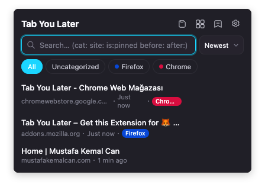
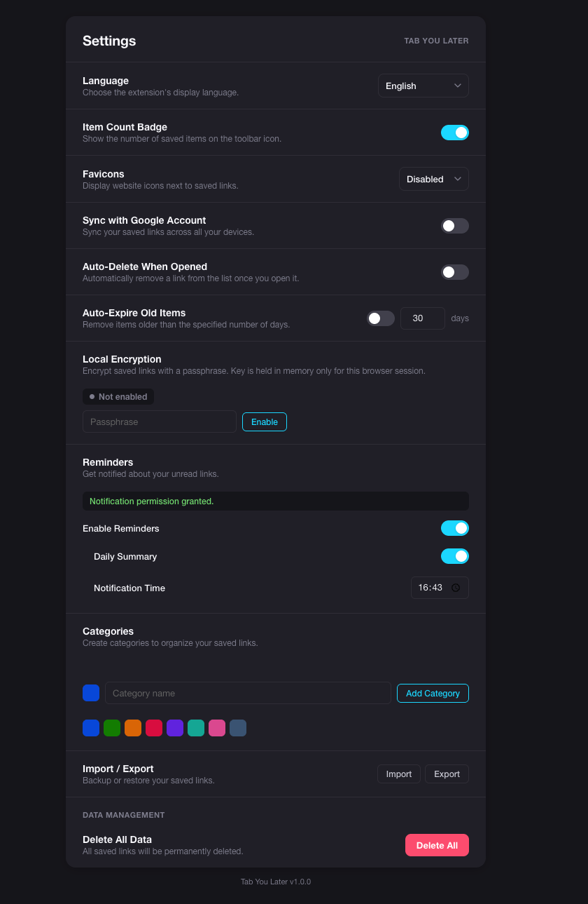
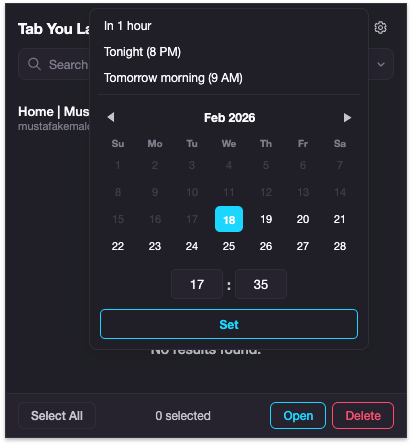

# Tab You Later

Cross-browser "read later" extension repository for Firefox and Chrome.

Tab You Later helps users quickly save tabs and links, organize them with categories, and revisit them later from a fast popup UI.

## Screenshots

### Main Menu



### Settings Page



### Reminder Picker



## Repository Structure

```text
tab-you-later/
├── firefox/   # Firefox build (Manifest V2)
│   ├── manifest.json
│   ├── background.js
│   ├── popup/
│   ├── options/
│   ├── onboarding/
│   ├── quick-category/
│   ├── i18n/
│   ├── icons/
│   └── README.md
└── chrome/    # Chrome build (Manifest V3)
    ├── manifest.json
    ├── background.js
    ├── popup/
    ├── options/
    ├── onboarding/
    ├── quick-category/
    ├── i18n/
    ├── icons/
    └── README.md
```

## Current Version

- Firefox: `1.0.2`
- Chrome: `1.0.2`

## Shared Feature Set

### Core

- Save page or link from context menu
- Save & Close current tab in one action
- Save & Close with category picker (when categories exist)
- Save all tabs in current window
- Real-time popup list with instant search
- Real-time UI updates when items change in the background
- Badge item count on toolbar icon (toggleable)
- Duplicate detection with visual cue

### Organization

- Color-coded categories with filter bar
- Quick category creation from right-click menu or popup (standalone mini-window, no page navigation)
- Save current page into a newly created category in a single step
- Category editing (rename and recolor from Settings)
- Pin important items to the top regardless of sort
- Sort by newest, oldest, alphabetical, domain, or manual drag-and-drop
- Bulk actions (open / delete multiple items)

### Per-URL Notes

- Attach a text note to any saved link
- Inline editing with save, cancel, and delete controls

### Search

- Real-time filter across titles and URLs
- Advanced operators: `cat:`, `site:`, `before:`, `after:`, `is:pinned`

### Reminders & Notifications

- Per-item reminders with custom date and time picker
- Daily summary notification
- Browser notification permission managed from Settings

### Privacy & Security

- Optional AES-GCM local encryption with session passphrase
- Network-minimized favicon mode (off / live / cached)
- No external servers — all data stays in browser-managed storage
- Dark / light mode adapts to system theme

### Data Management

- Browser sync (Firefox Account or Google Account)
- Import / export JSON backup
- Auto-delete on open
- Auto-expire items older than a configurable number of days
- 5-second undo delete
- Onboarding page on first install

### Internationalization

- Full i18n: English, Turkce, Deutsch, Francais, Espanol, Chinese (Simplified), Japanese
- Language auto-detected from browser, changeable in Settings

## Install (Development)

### Firefox

1. Open `about:debugging#/runtime/this-firefox`
2. Click **Load Temporary Add-on…**
3. Select `firefox/manifest.json`

### Chrome

1. Open `chrome://extensions`
2. Enable **Developer mode**
3. Click **Load unpacked**
4. Select the `chrome/` folder

## Browser Store URLs

- **Firefox Add-ons:** [https://addons.mozilla.org/firefox/addon/tab-you-later/](https://addons.mozilla.org/firefox/addon/tab-you-later/)
- **Chrome Web Store:** [https://chromewebstore.google.com/detail/tab-you-later/hhggidekeifkiafeoclfjmhfdboehiib](https://chromewebstore.google.com/detail/tab-you-later/hhggidekeifkiafeoclfjmhfdboehiib)

## Browser-Specific Notes

| Browser | Notes |
|---|---|
| Firefox | Uses Manifest V2 and `browser.*` APIs |
| Chrome | Uses Manifest V3 service worker and `chrome.storage.session` for session-state resilience |

## Privacy

No external backend is used. User data is stored in browser-managed storage APIs (`local`, optional `sync`, and `session` where applicable).

## Additional Docs

- Firefox details: [firefox/README.md](firefox/README.md)
- Chrome details: [chrome/README.md](chrome/README.md)

## License

Provided as-is for personal use.
